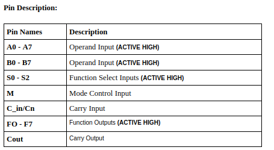
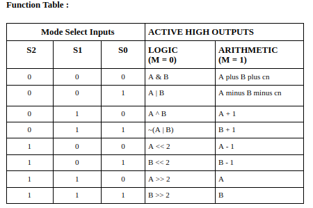
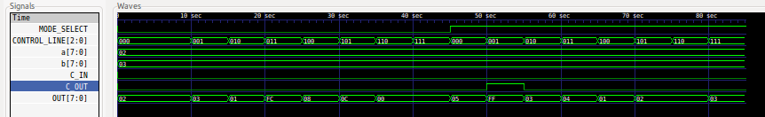
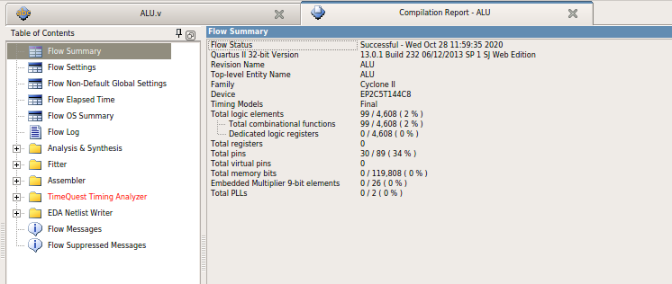
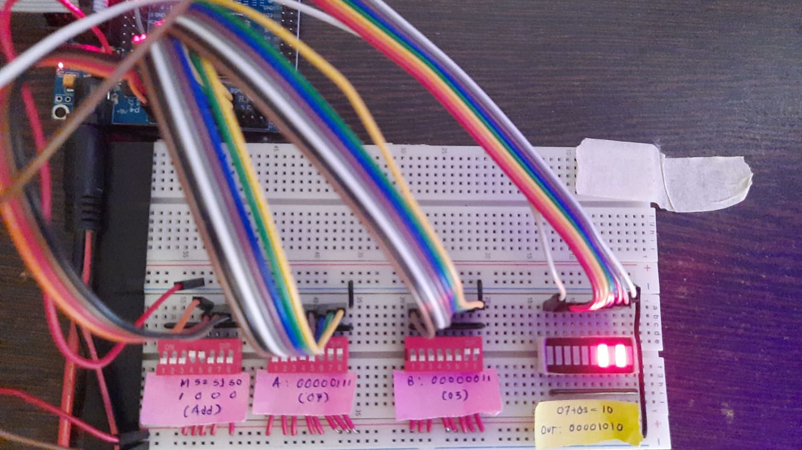

# 8-Bit-ALU-Implementation-on-CYCLONE-2

- [Github Link](https://github.com/ombhilare999/8-Bit-ALU-implementation-on-CYCLONE-2)
- [Verilog Code](https://github.com/ombhilare999/8-Bit-ALU-implementation-on-CYCLONE-2/blob/main/ALU/ALU.v)
- [Test Bench Code](https://github.com/ombhilare999/8-Bit-ALU-implementation-on-CYCLONE-2/blob/main/ALU/ALU_TB.v)
- [Docs](https://github.com/ombhilare999/8-Bit-ALU-implementation-on-CYCLONE-2/blob/main/Assets/Omkar%20Bhilare%20-%208%20Bit%20ALU.pdf)
## Pin description:

    

## Function Table:

    

## GTK Wave Output:

    

## Compilation Output:

    

## Hardware Output on CYCLONE II:

    

## TO DO:
- Add schematic with pin assignments
- Add min/max delay on input and output ports